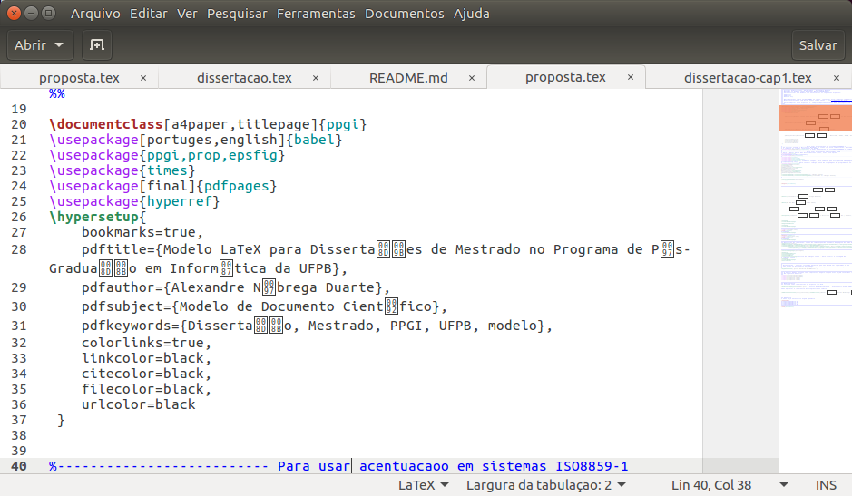
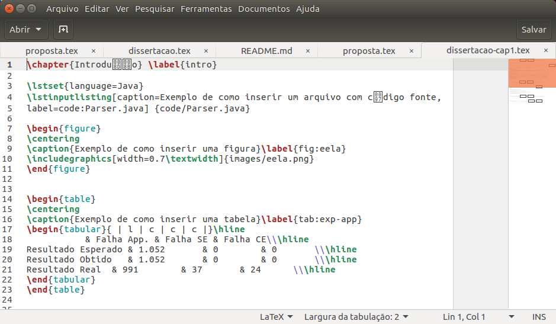

# ufpb-ppgi-latex-template-dissertacao-uft8

Este repositório contém o template latex do PPGI para dissertação codificado em utf-8. 

## Baixando o template

O template pode ser baixado [neste link](https://github.com/edusantana/ufpb-ppgi-latex-template-dissertacao-uft8/releases/download/v0.2.3/ufpb-ppgi-latex-template-dissertacao-uft8-v0.2.3.zip) ou através do comando:

    wget https://github.com/edusantana/ufpb-ppgi-latex-template-dissertacao-uft8/releases/download/v0.2.3/ufpb-ppgi-latex-template-dissertacao-uft8-v0.2.3.zip

## Compilando

Para gerar os PDFs será necessário compilar os arquivos.

Para compilar a proposta utilize:

    latexmk -xelatex proposta.tex
    
Para compilar a dissertação utilize:

    latexmk -xelatex dissertacao.tex

# Usuários do Windows e OS X

Em vez de alterar a codificação ou configuração dos arquivos, recomendo alterar a codificação do seu editor para utilizar UTF-8 nos arquivos deste projeto.

# Obtendo ajuda sobre o latex

Caso tenha dúvidas sobre utilização do Latex considere postá-las no [grupo latex-br](https://groups.google.com/forum/#!forum/latex-br).

# Sobre o template original

O template original, criado por Alexandre Nóbrega, pode ser encontrado [nesse link](http://cl.ly/2Z16461O1B3O463J0S3j).

Vamos compilar a proposta:

```
$ latexmk -pdf proposta.tex
```

A compilação ocorre normalmente e o arquivo `proposta.pdf` gerado não apresenta erros de codificação.

No entanto, ao abrir os arquivos fontes verificamos o problema de codificação:





Para utilizar um editor configurado com a codificação UTF-8 o usuário deve alterar a configuração do pacote `inputenc`, alterando `applemac` para `utf8x`:

```tex
% Substituir a linha abaixo
\usepackage[applemac]{inputenc}
% Por essa
\usepackage[utf8x]{inputenc}
```

Após a alteração, vamos compilar novamente:

```bash
$ latexmk -pdf proposta.tex
(...)
! Package utf8x Error: Character141appearedalone.

See the utf8x package documentation for explanation.
Type  H <return>  for immediate help.
 ...
                                                  
l.95 \PaginadeRosto
```

Esta alteração por si só não é suficiente, pois os arquivos foram escritos com a codificação utilizada no sistema do autor, veja a codificação dos arquivos do template original:

```
$ file -i *
abnt-alf.bst:         text/plain; charset=iso-8859-1
abnt-alf.sty:         text/plain; charset=us-ascii
abstract.tex:         text/plain; charset=us-ascii
agradecimentos.tex:   text/plain; charset=us-ascii
apendice-a.tex:       text/x-tex; charset=utf-8
apendice-b.tex:       text/x-tex; charset=utf-8
apendice-c.tex:       text/x-tex; charset=utf-8
apendice-d.tex:       text/x-tex; charset=utf-8
code:                 inode/directory; charset=binary
cvs-id.def:           text/plain; charset=iso-8859-1
dissertacao-cap1.tex: text/x-tex; charset=unknown-8bit
dissertacao-cap2.tex: text/x-tex; charset=unknown-8bit
dissertacao-cap3.tex: text/x-tex; charset=unknown-8bit
dissertacao-cap4.tex: text/x-tex; charset=unknown-8bit
dissertacao-cap5.tex: text/x-tex; charset=unknown-8bit
dissertacao-cap6.tex: text/x-tex; charset=unknown-8bit
dissertacao.pdf:      application/pdf; charset=binary
dissertacao.tex:      text/x-tex; charset=unknown-8bit
fancyheadings.sty:    text/x-tex; charset=us-ascii
images:               inode/directory; charset=binary
inpi.sty:             text/x-tex; charset=iso-8859-1
main.bib:             text/plain; charset=unknown-8bit
main.pdf:             application/pdf; charset=binary
mestre.sty:           text/plain; charset=us-ascii
ppgi.cls:             text/x-tex; charset=us-ascii
ppgi.sty:             text/plain; charset=us-ascii
proposta-cap4.tex:    text/x-tex; charset=unknown-8bit
proposta-cap5.tex:    text/x-tex; charset=unknown-8bit
proposta-cap6.tex:    text/x-tex; charset=unknown-8bit
proposta.pdf:         application/pdf; charset=binary
proposta.tex:         text/x-tex; charset=unknown-8bit
prop.sty:             text/plain; charset=us-ascii
resumo.tex:           text/plain; charset=us-ascii
simbolos.tex:         text/x-tex; charset=us-ascii
```

Podemos perceber que a maioria dos arquivos não estão na codificação utf-8. Esse repositório portanto contém os arquivos com a alteração e codificados com utf-8:

```
$ file -i *
abnt-alf.bst:         text/plain; charset=utf-8
abnt-alf.sty:         text/plain; charset=us-ascii
abstract.tex:         text/plain; charset=us-ascii
agradecimentos.tex:   text/plain; charset=us-ascii
apendice-a.tex:       text/x-tex; charset=utf-8
apendice-b.tex:       text/x-tex; charset=utf-8
apendice-c.tex:       text/x-tex; charset=utf-8
apendice-d.tex:       text/x-tex; charset=utf-8
code:                 inode/directory; charset=binary
cvs-id.def:           text/plain; charset=utf-8
dissertacao-cap1.tex: text/x-tex; charset=utf-8
dissertacao-cap2.tex: text/x-tex; charset=utf-8
dissertacao-cap3.tex: text/x-tex; charset=utf-8
dissertacao-cap4.tex: text/x-tex; charset=utf-8
dissertacao-cap5.tex: text/x-tex; charset=utf-8
dissertacao-cap6.tex: text/x-tex; charset=utf-8
dissertacao.tex:      text/x-tex; charset=utf-8
fancyheadings.sty:    text/x-tex; charset=us-ascii
images:               inode/directory; charset=binary
inpi.sty:             text/x-tex; charset=utf-8
main.bib:             text/plain; charset=utf-8
mestre.sty:           text/plain; charset=us-ascii
ppgi.cls:             text/x-tex; charset=us-ascii
ppgi.sty:             text/plain; charset=us-ascii
proposta-cap4.tex:    text/x-tex; charset=utf-8
proposta-cap5.tex:    text/x-tex; charset=utf-8
proposta-cap6.tex:    text/x-tex; charset=utf-8
proposta.tex:         text/x-tex; charset=utf-8
prop.sty:             text/plain; charset=us-ascii
Rakefile:             inode/x-empty; charset=binary
README.md:            text/plain; charset=utf-8
resumo.tex:           text/plain; charset=us-ascii
simbolos.tex:         text/x-tex; charset=us-ascii

```

Dessa forma você poderá compilar e editar os arquivos sem problemas.
